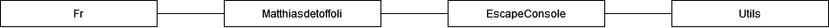

# EscapeConsole
Game playing only with text in a console where you will have to escape from a maze

## Contents
**I** *- [Versions](#versions)*

**II** *- [About it](#about-it)*
* **A** *- [Why this ?](#why-this)*
* **B** *- [What is it ?](#what-is-it)*
* **C** *- [Platform target](#platform-target)*

**III** *- [Tools](#tools)*
* **A** *- [Research](#research)*
* **B** *- [Software](#software)*
* **C** *- [Language](#language)*

**IV** *- [Project](#project)*
* **A** *- [Namespaces](#namespaces)*
* **B** *- [Coding rules](#coding-rules)*
	* *[Include](#include)*
	* *[Namespaces](#namespaces-1)*
	* *[Filters](#filters)*
	* *[Structure of a class](#structure-of-a-class)*
	* *[Singletons](#singletons)*
	* *[Brackets](#brackets)*
	* *[Regions](#regions)*
	* *[Methods](#methods)*
	* *[Comments](#comments)*
	* *[Variables](#variables)*
	* *[Values](#values)*
	* *[Condition](#condition)*
	* *[Loops](#loops)*
	* *[Nomenclature](#nomenclature)*
		* *[Filters](#filters-1)*
		* *[Namespaces](#namespaces-2)*
		* *[Classes](#classes)*
		* *[Methods](#methods-1)*
		* *[Constants](#constants)*
		* *[Properties](#properties)*
		* *[Members](#members)*
		* *[Variables](#variables-1)*
		* *[Parameters](#parameters)*
		* *[Enums](#enums)*
* **C** *- [Commit rules](#commit-rules)*
	* *[Commit keywords](#commit-keywords)*
	* *[main](#main)*
	
## Versions
| VX.X | Date       | Title  						| Comments													| Author              |
| ---- | ---------- | ------------------------------| ----------------------------------------------------------| ------------------- |
| V0.0 | 12/01/2022 | Creation of the documentation	| Create the document and add the first parts				| Matthias de Toffoli |


## About it
### Why this?
Practice C++ and do a little program with it
### What is it?
It's a console app you will have to write where you want to go and it write what happen, the goal is to escape from a maze describe textually
### Platform target
PC

## Tools
### Research
No tool research was made for this project because the goal is to Practice C++
### Software
Visual studio 2022
### Language
C++

## Project

### Namespaces


### Coding rules
The main language of the project is English, so all things have to be write in English (comments, names, classes, etc...)
#### Include
All includes are at top of the document and sort by alphabetical order.
*It's more legible.*

#### Namespaces
Namespaces always into Fr > MatthiasDeToffoli > EscapeConsole followed by the name of the filters.
*Keep a current structure with my other projects to find files.*

#### Filters
Headers and Source files has to have the same sub filters 
*Easier to find files*

#### Structure of a class
In the header private elements first, follow by protected and public elements, try to write first the constants followed by the events, the members, the properties, after that the constructors and finally the methods the cpp file as to follow more as possible the header structure.
*More legible*

### Singletons
use it less as possible.
*Use too many singletons is not a good practice*

#### Brackets
Open the Bracket at the bottom of the instruction and start a new line for close it.

```cpp
Instruction() 
{
	…
}
```
If it's empty between the two brackets let them side by side
```cpp
Instruction() { }
```
*More legible*

#### Regions
Don't use regions
*useless the .h will show a legible structure.*

#### Methods
Write in order of calling most as possible.
*Easier to read and understand*

#### Comments
Comment most as possible,
for classes, methods and properties use the summary
```cpp
/**
* /// <summary>
* ///
* /// </summary>
* /// <param name="pTest"></param>
* /// <returns></returns>
* int Instruction(bool pTest);
```
complete all parts even if it's obvious (maybe it's not for others).
Comment headers and cpp files.

For comments in methods use simple comments with //
don't write comments at the left of a line all comments have to be in its own line, let a blank line
before write a comment but not after.
```cpp
code

//comments
code
```
*More legible*

#### Variables
All variables have to be created at the start of the function even for loop's variables don't let blank line
between two variable declarations (except if you have a comment before one of them) but let one
after all variables declarations.
You can declare some variables in the same line if no one is initialized in the declarations, always go to the
next line after an initialization.
```cpp
void MyFunction () 
{
	int i,j = 0 ;
    int k ;
	float l ;
    //comments
	char* str ;
    l = 0.5f;
}
```

*More legible*


#### Values
Never write a value directly
```cpp 
if(lifeAnswer == 42)
```
always write values in constant or variable
```cpp
const int TRUE_ANSWER = 42; 
if (lifeAnswer == TRUE_ANSWER)
```
*More legible and efficient if you must change the value*

#### Condition
You can don't use brackets with an if, only if it's a value to set in the same line or before a loop like:

``` cpp
if(lMyInt == 17) 
	lMyIntIsSeventeen = true;
	
if(lCanUseLoop)
	for(i = 0, l = 3; i < l; i++) 
	{
		...
	}
```
Use the brackets for conditions before a return too.
Go to the next line before writing else
*More legible*

#### Loops
Use most as possible for loops, always use brackets with it
```cpp
int i,l ;
for (i = 0, l = 3 ; i < l ; i++) 
{
	...
}
```
it's easier for make a reverse for loop
```cpp
int i,l ;
for (i = 0, l = 3 ; i < l ; l--) 
{
	...
}
```
*More legible*

#### NOMENCLATURE
##### Filters
Upper camel case
*More legible.*
##### Namespaces
Like folders
*More legible*
##### Classes
Upper camel case
*More legible.*
##### Methods
Upper camel case
*More legible.*
##### Constants
Write with capitals and all words separate with an underscore
*More legible.*
##### Properties
Lower camelcase
*More legible.*
##### Members
mMyField
*More legible*
##### Variables
lMyVar;
*More legible*
##### Parameters
pMyParameter
*More legible*
##### Enums
Write the name of the Enum with upper camel case, all values will be written with majuscules and if it contain many words every words are separated by an underscore.
``` cpp
enum MyEnum 
{
	VAL_1,
	VAL_2,
	VAL_3
}
```
*More legible*

### Commit rules

#### Commit keywords
For this project I will use a key word between *[]* followed by a short description 

* [ADD] for all commit concerning the adding of a new feature. *I will not use it inevitably when I add a new element in my project *
* [UPDATE] for all commit concerning the updating of an existing feature
* [FIX] for all commit concerning the fix of a feature
* [QUALITY] for all commit concerning quality (add a missing file, delete a useless file etc...)

I can add *.WIP* after the key for say it's not finished. If I do that the commit used when the feature will be finished will be the same without a WIP. That's mean a commit with the key *[ADD.WIP]* will be followed by a commit *[ADD]* when the feature will be finished.

#### main
I will push on main only finished features. The project must always work on main. I will use other branches for my developments.